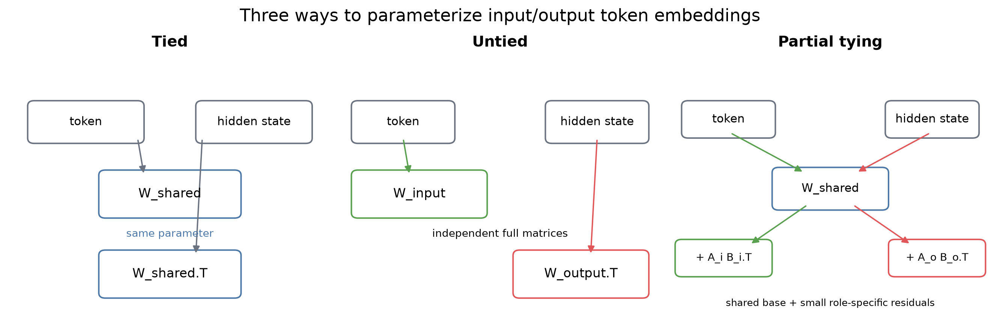

# Tied, untied, and partially tied language-model embeddings

> **Research status:** Final release for the declared studies. The implementation, fairness gates, cloud runs, mechanism diagnostics, analysis artifacts, and paper bundle are complete. Under the tested small-model protocols, the results do **not** support a performance advantage for low-rank partial tying. The conclusion is specific to these datasets, model sizes, and training budgets; it is not a claim about all language models.

This project tests whether a decoder-only language model can keep the parameter savings of weight tying while allowing its input and output token representations to specialize slightly. The comparison is:

- **Tied:** one vocabulary matrix is used for token lookup and output prediction.
- **Untied:** input and output use separate full matrices.
- **Partial:** one shared matrix plus independent low-rank corrections:

  ```text
  W_input  = W_shared + A_input  B_input.T
  W_output = W_shared + A_output B_output.T
  ```

The partial model adds only `2 * rank * (vocab_size + width)` parameters. It is a direct test of whether role-specific flexibility is useful, rather than an assumption that untying or adapters must help.



## What the completed studies found

The primary confirmatory study used WikiText-2-raw-v1, GPT-2 BPE, a 6-layer/6-head/384-width decoder, block size 256, 50,000 fresh optimizer steps, and seeds 1337, 2027, and 31415. Every comparison passed the exact token-stream and final-step fairness gate. Lower validation loss is better.

| Condition | Final loss | Final perplexity | Total parameters | Extra vs tied |
|---|---:|---:|---:|---:|
| Tied | 5.06856 | 158.95 | 30,023,808 | 0 |
| Partial, rank 8 | 5.10784 | 165.33 | 30,834,064 | 810,256 |
| Untied | 5.42733 | 227.64 | 49,322,496 | 19,298,688 |
| Parameter-matched tied control | 5.27932 | 196.25 | 30,834,816 | 811,008 |

Across the three paired seeds, partial minus tied final loss was `+0.03928` with a descriptive bootstrap interval `[+0.01715, +0.06728]`. Untied minus tied was `+0.35877` with a descriptive bootstrap interval `[+0.31560, +0.38145]`. Because untied was worse than tied, the requested “fraction of the untied improvement recovered” is undefined. The capacity control was also worse than tied and worse than rank-8 partial, so the result does not reduce to a simple benefit from adding approximately 0.8M parameters elsewhere.

The three-seed 10k study is preserved as **Study 1**, a preliminary horizon. Its rank-1/2/4/8/16/32 sweep is now replicated across three seeds. No rank consistently improves on tied; rank 32 is closest in mean final loss, but its paired interval still includes no difference. A smaller WikiText-2 model and a Tiny Shakespeare replication likewise show no reliable partial-tying gain. On Tiny Shakespeare, the tied model remains best at the final checkpoint, while the capacity control shows late overfitting.

The mechanism measurements provide a narrower result. At 50k steps, output-to-input effective gradient ratios are close to one rather than showing stable output dominance. Partial corrections become nonzero and the output correction is larger in norm than the input correction, but their effective matrix alignment is weak and this does not translate into lower language-modeling loss. In the three-seed 10k path interventions, stopping input-path gradients changed partial minus tied final loss by `+0.00037` (descriptive bootstrap interval `[-0.00676, +0.00798]`), while stopping output-path gradients changed it by `-0.00618` (descriptive bootstrap interval `[-0.01474, +0.01011]`); neither is a stable causal effect. Token-frequency buckets, correction spectra, and frozen input probes are included as separate artifacts; they should not be read as evidence that validation loss alone measures embedding quality.

The strongest supported conclusion is therefore: **in this regime, tied embeddings are a strong baseline; full untying is harmful; low-rank role-specific corrections add flexibility and measurable role-specific movement but do not recover a quality advantage.**

All headline values are generated from machine-readable aggregates under [`results/`](results/). The raw compact per-run metrics, manifests, hashes, and fairness outputs are under [`results/release_artifacts/`](results/release_artifacts/), indexed by [`final_release_manifest.json`](results/release_artifacts/final_release_manifest.json). Checkpoints and optimizer states are intentionally excluded.

The final manuscript is [`paper/main.pdf`](paper/main.pdf); the independently compilable source bundle is [`arxiv/`](arxiv/).

## Model and computation

The normal training path keeps partial corrections factorized. For token lookup it computes:

```text
shared[token_ids] + scale * input_A[token_ids] @ input_B.T
```

For output logits it computes:

```text
hidden @ shared.T + scale * (hidden @ output_B) @ output_A.T
```

The full `V × D` correction matrices are reconstructed only for diagnostics. Tests compare the optimized operations with explicit matrix construction. Partial corrections start at zero effective value, and untied input/output matrices start from equivalent tied initialization.

The training and validation code records losses, perplexity, parameter counts, estimated FLOPs, throughput, peak memory, exact data-stream digests, effective input/output gradient norms and cosines, token-frequency and token-class summaries, correction norms and spectra, and frozen input/output representation probes. `validate_study.py` rejects incomplete or mismatched studies before aggregation.

The parameter-matched `capacity_control` condition keeps embeddings tied and adds a zero-initialized, bias-free residual bottleneck MLP to the final hidden states. Its width is 1,056 in the main configuration, adding 811,008 parameters versus 810,256 for rank-8 partial tying.

## Reproduce the studies

Install the portable environment in a clean checkout:

```bash
python3 -m pip install -r requirements.txt
```

The Kaggle reference environment is pinned in [`requirements-lock.txt`](requirements-lock.txt). All substantive model training for the released studies ran in Kaggle. Local commands are for validation, aggregation, figures, tests, and LaTeX packaging.

The exact source commits used for the released studies are recorded in their manifests:

```text
50k primary:          56f6360ad93eadff2c6ad1406a4805264549747f
rank replication:     e8aa5e87b07810596940df5f66b5c92c7d825569
robustness/ablations: 77923885b40f9e80c0f0a0f6fb6e94e9bdfc51db
```

Launch fresh cloud runs with the Kaggle tooling:

```bash
python3 kaggle/orchestrate.py --profiles long --seeds 1337 2027 31415 \
  --commit 56f6360ad93eadff2c6ad1406a4805264549747f
python3 kaggle/orchestrate.py --profiles rank --seeds 1337 2027 31415 \
  --commit e8aa5e87b07810596940df5f66b5c92c7d825569
python3 kaggle/orchestrate.py --profiles small_scale second_dataset \
  --seeds 1337 2027 31415 --commit 77923885b40f9e80c0f0a0f6fb6e94e9bdfc51db
python3 kaggle/orchestrate.py \
  --profiles mechanism_stop_input mechanism_stop_output \
  --seeds 1337 2027 31415 --commit 77923885b40f9e80c0f0a0f6fb6e94e9bdfc51db
```

These commands submit Kaggle kernels and collect compact artifacts; they never train on the local machine. Validate every collected study before analysis:

```bash
python3 validate_study.py --runs_dir cloud_artifacts/long_seed1337_exact56f
python3 aggregate_results.py \
  --studies cloud_artifacts/long_seed1337_exact56f \
            cloud_artifacts/long_seed2027 \
            cloud_artifacts/long_seed31415 \
  --output_dir results/long_50k
```

Regenerate the release tables and arXiv bundle locally from checked-in aggregates:

```bash
python3 paper/generate_figures.py --output-dir results/long_50k/figures
python3 paper/generate_tables.py \
  --primary results/long_50k/primary_aggregate.json \
  --rank results/rank_sweep/rank_aggregate.json \
  --mechanism results/long_50k/mechanism/mechanism_aggregate.json \
  --secondary results/secondary/secondary_aggregate.json \
  --embedding results/long_50k/embedding_eval/embedding_eval_aggregate.json \
  --interventions-input results/mechanism_interventions_input.json \
  --interventions-output results/mechanism_interventions_output.json \
  --output-dir paper/generated
python3 paper/package_arxiv.py --output-dir arxiv
cd arxiv && tectonic --keep-logs main.tex
```

For a small instrumentation-only check, use the command in [`REPRODUCIBILITY.md`](REPRODUCIBILITY.md). It is intentionally too short to support a scientific claim. Detailed protocol, data pinning, fairness requirements, and artifact handling are documented in [`EXPERIMENT_PROTOCOL.md`](EXPERIMENT_PROTOCOL.md), [`REPRODUCIBILITY.md`](REPRODUCIBILITY.md), and [`kaggle/README.md`](kaggle/README.md).

## Repository map

- [`model.py`](model.py) — decoder-only Transformer and tied/untied/partial embedding implementations.
- [`train.py`](train.py), [`sweep.py`](sweep.py) — single-run training and matched study orchestration.
- [`validate_study.py`](validate_study.py), [`aggregate_results.py`](aggregate_results.py) — fairness gate and loss/parameter aggregation.
- [`mechanism_eval.py`](mechanism_eval.py), [`aggregate_mechanism.py`](aggregate_mechanism.py), [`aggregate_interventions.py`](aggregate_interventions.py) — effective gradient, correction, token-class, and intervention diagnostics.
- [`embedding_eval.py`](embedding_eval.py), [`aggregate_embedding_eval.py`](aggregate_embedding_eval.py) — frequency-matched neighbors, lexical probes, and frozen input/output evaluations.
- [`analyze.py`](analyze.py), [`aggregate_rank.py`](aggregate_rank.py), [`aggregate_secondary.py`](aggregate_secondary.py) — paired statistics, rank fronts, robustness summaries, and plots.
- [`paper/`](paper/) — manuscript source and machine-generated tables.
- [`arxiv/`](arxiv/) — independently compilable source bundle.
- [`docs/`](docs/) — protocol and historical exploratory records.

## Related work

Weight tying was introduced and analyzed by [Press and Wolf (2017)](https://aclanthology.org/E17-2025/) and [Inan, Khosravi, and Socher (2017)](https://arxiv.org/abs/1611.01462). Studies of input/output representation differences and decoupling include [Gulordava et al. (2018)](https://aclanthology.org/D18-1323/), [Derby, Miller, and Devereux (2020)](https://aclanthology.org/2020.conll-1.36/), and [Chung et al. (2021)](https://openreview.net/forum?id=xpFFI_NtgpW). [Bertolotti and Cazzola (2024)](https://proceedings.mlr.press/v235/bertolotti24a.html) analyze distributional assumptions behind tying. Low-rank updates follow the computational pattern of [LoRA](https://arxiv.org/abs/2106.09685), while adaptive input representations provide a related but different vocabulary-factorization approach ([Baevski and Auli, 2019](https://openreview.net/forum?id=ByxZX20qFQ)).

Recent work has also examined output-space bias and alternatives to hard tying, including [Lopardo et al. (2026)](https://aclanthology.org/2026.findings-acl.2027/), [Batley and Saha (2026)](https://arxiv.org/abs/2601.22040), and [Gu et al. (2026)](https://arxiv.org/abs/2602.04556). This project makes a narrower distinction: rather than choosing between fully tied and fully untied embeddings, it tests whether a large shared base plus small role-specific low-rank residuals can recover flexibility at lower parameter cost. It does not claim architectural novelty beyond that controlled comparison.

## Limitations

The main study uses one tokenizer, one WikiText-2 configuration, and three seeds. The rank sweep is a matched 10k study rather than a 50k sweep. The robustness checks use a smaller model and Tiny Shakespeare, not a large corpus or modern large-language-model scale. FLOP counts are estimates based on declared dense and factorized operations. Representation probes are frozen token-level diagnostics, not downstream task evaluations. The results support a narrow negative/mechanistic conclusion and should not be generalized beyond the tested regime.

## License

Released under the [MIT License](LICENSE). Citation metadata is in [`CITATION.cff`](CITATION.cff).
